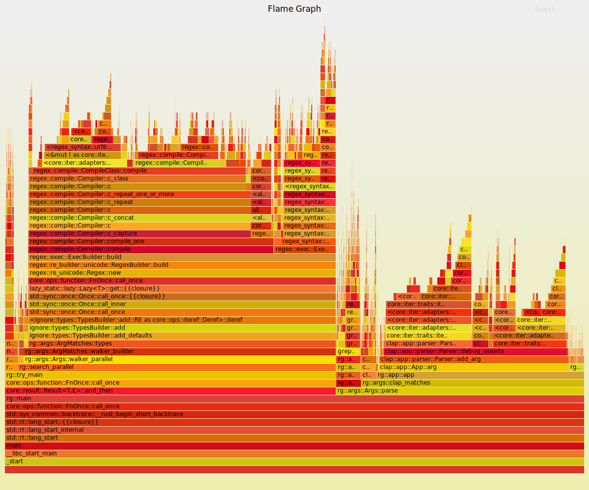
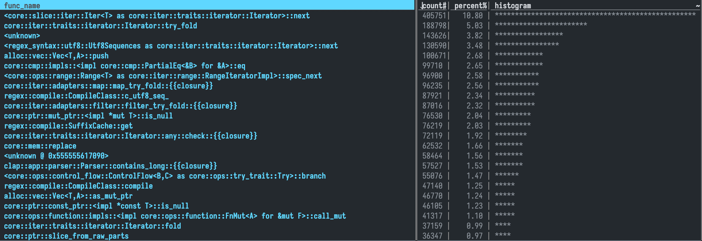
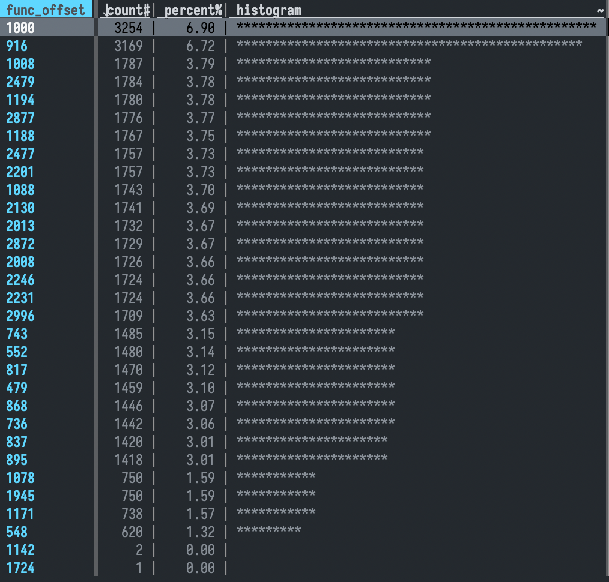

# Superprofiler

The "superprofiler" uses a combination of random sampling and dynamic code analysis to achieve high precision profiling with (aspirationally) comparatively low overhead. Like all trendy modern CLI tools, it is written in Rust.

## Building from source
Install [Rust](https://rustup.rs/) and the following (if you are on Ubuntu):
```
sudo apt-get install build-essential # if you don't have C toolchain
sudo apt-get install pkg-config
sudo apt-get install libunwind-dev
sudo apt-get install -y clang # if you are running AArch64 (ARM64)
```
In order to build the superprofiler, clone this repository and run `cargo build`. Note that installing `libunwind` might be a bottleneck on other operating systems.

## Supported Architectures

Currently, the superprofiler supports AArch64 (sort of) and x86 (fully).

## Design Goals

- Architecture independent.
- Can attach to a running program.
- Catches (almost) all functions/instruction blocks (at least in long-running programs).

## Components

- **Dynamic code analyzer** (in the `analyzer` thread) — given access to a program's memory (i.e., it's code) and an instruction pointer, both (1) automatically figure out which instruction encodings are branches of any sort, and (2) figure out the end of the block (once part (1) is complete).
- **Supervisor** — works with the dynamic code analyzer to insert breakpoints, collects sampling data, interfaces with `ptrace(...)`.
- **Profiler** — reads profiling data from the supervisor and manages output files.

## Usage

```
superprofiler 0.1.0
A smart profiler (experimental!)

USAGE:
    superprofiler [OPTIONS]

OPTIONS:
    -a, --allow-bottlenecking
            Allow bottlenecking in instrumentation

    -c, --command <COMMAND>
            Command to profile

        --flame
            Generate flamegraph after execution completes (requires `inferno-flamegraph` to be
            installed)

        --func-instrumentation-depth <FUNC_INSTRUMENTATION_DEPTH>
            The number of functions to ignore at the bottom of the callstack when instrumenting
            [default: 5]

    -h, --help
            Print help information

    -i, --interval <INTERVAL>
            Sample interval (microseconds; lower is faster) [default: 100]

    -n, --no-instrumentation
            Disable instrumentation

        --name <NAME>
            The run name (used to generate output files)

        --only-funcs <ONLY_FUNCS>
            Function instrumentation allowlist

        --only-instrument-execs <ONLY_INSTRUMENT_EXECS>
            Executable instrumentation allowlist

    -p, --pid <PID>
            The pid to attach to

    -s, --single
            Profile entirely using single stepping

    -t, --trace-prob <TRACE_PROB>
            The probability of collecting a trace on any given sample (not from instrumentation) (to
            disable traces, set to zero) (between zero and one) [default: 0.1]

    -V, --version
            Print version information
```

## Examples

Profile a simple command with instrumentation enabled:

```bash
superprofiler -c "echo hello"
```

Profile a single command without instrumentation enabled (i.e., statistical sampling):

```bash
superprofiler -c "echo hello" --no-instrumentation
```

Profile a single command in single stepping mode (slow, but perfect accuracy):

```bash
superprofiler -c "echo hello" --single
```

Profile specific functions using instrumentation (statistical sampling will be performed as well):

```bash
superprofiler -c "echo hello" --only-funcs "func_name"
```

Profile with a very high sample rate (1 microsecond average between samples):

```bash
superprofiler -c "echo hello" -i 1
```

Profile with a very high sample rate and generate a flamegraph (1 microsecond average between samples):

```bash
superprofiler -c "echo hello" -i 1 --flame
```

Attach to an existing process (note: deinstrumentation on detach is WIP):

```bash
superprofiler -p $(pgrep executable...)
```

## Dynamic Code Analysis

The first goal of the dynamic code analyzer is to figure out which instruction encodings are branches. In order to accomplish this it:

1. Single steps through the process it is attached to, monitors changes in pc that reflects a branch and stores the encoding of the instruction that resulted in the change.
2. Predicts what opcodes/instruction encodings might map into a branch. Our goal is to exit single stepping as soon as possible, and only interrupt the program when we suspect that we have reached the end of a basic block.

    > Certain instructions ("pop {pc}", "movs pc, lr") result in a change only when the destination register is the program counter. In this case, we cannot rely only on the opcode information. On the other hand, recognizing patterns among opcodes of branch instructions help us predict what instructions result in a branch, and we can exit single stepping mode as soon as possible + handle instruction encodings that we have not encountered before.

3. Exits single stepping, adding breakpoints to a predicted branch. We need to come up with some metric that decides that we have sufficiently collected information about branch instructions.
4. To make things faster, (perhaps) keeps a lookup table of possible branch points of an instruction located at a particular address + keep a list of branch opcodes for widely-used instruction sets. 

## Challenges

* We spent a lot of time trying to get ptrace working on Mac; we tried code signing, "entitlements," and more... nothing worked.
* We didn't know this when we started the project, but there is some code in a program's memory that just can't be instrumented. Shared objects, loaders, code inserted by the kernel to handle some syscalls locally — you just don't want to touch it. We read information from the kernel to figure out which binaries we can instrument and which we can't.
* Stacktrace unwinding was challenging, and it's quite slow. Thankfully [libunwind](https://www.nongnu.org/libunwind/) exists. We used it.
* Sometimes you'll instrument a jump that is used so much that you just kill the program's speed. We call these "bottlenecking instrumentations." We added a system that would automatically deinstrument these bottlenecks, though this can be disabled with `--allow-bottlenecking`.
* Handling signals is tough. As the tracer, you intercept *all* signals, and it's your responsibility to pass those on to the tracee. But sometimes you send signals to the program yourself (e.g., `SIGSTOP` to do statistical sampling), and you don't necessarily want to forward those on.
* There are endless race conditions (e.g., what if another process sends SIGSTOP and not the sampler, but the sampler then also sends a SIGSTOP?)
* ARM64 ptrace is different—there is no GETREGS and Rust ptrace doesn’t actually implement ARM64; had to interface with new C structs
* ARM64 doesn’t have a clear alternative for 0xCC (INT3) and ARM’s pc register is off by two instructions—however, on BRK (debug instruction), it seems to not be offset, so easy to get into a infinite loop and hard to manage rewinding PC when hitting a breakpoint.

## Output

Here's a demo flamegraph output. This particular flamegraph is of `ripgrep` parsing arguments and compiling its query.



Beyond general call graphs, though, the profiler also outputs high-precision information about the program's execution (which it gleans through instrumentation). It stores this information as a TSV file, which can be viewed using [VisiData](https://www.visidata.org/).

Importantly, this information isn't gathered through profiling — it's through instrumentation, which means that (once the instruction is instumented) it has perfect resolution.

Here's what viewing the most frequently executed functions in VisiData looks like:



And here's what looking at what the most frequently executed basic blocks *within* a function looks like (the blocks themselves must currently be inferred from the offset):


